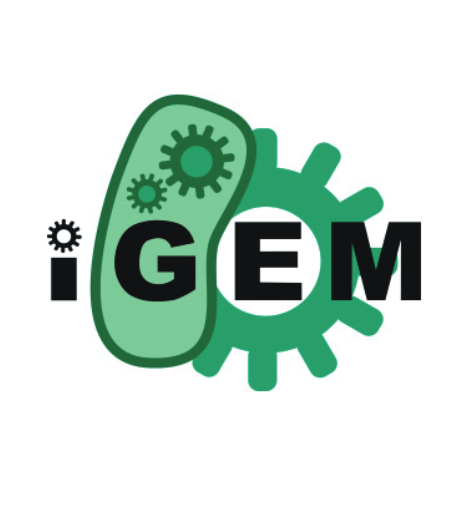

iGEM は MIT によってはじめられた合成生物学の世界大会です。合成生物学は遺伝子などをプログラミングし生物を「創造」する学問。iGEM では工学と生物の融合をテーマに、合成生物学の手法を用いて ,「社会的な課題を解決」したり「面白い動きをする」微生物を創造し、その独創性を競います。例年大会は 11 月に大会がボストンで開催され、世界中からチームが集まります。例えば、過去には血液の代わりで使える微生物、バナナの匂いをだす微生物、クモの糸を紡ぐ微生物、数独をとく微生物などなどが出されています。
