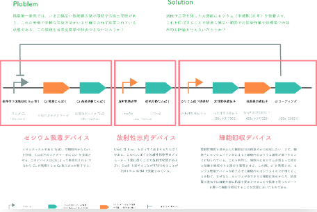

環境中からの有害な金属を除去する微生物を考えています。アプローチとしては、現状酵母の膜上に任意の金属結合タンパクを発現させ回収・分離して金属（レアメタルなど）を再利用するアプローチや、強靭な素材として注目されるクモの糸タンパク質と金属吸着タンパク質を混ぜた合成クモ糸タンパク質を紡ぐ微生物を考えています。目下研究中です。（左図：福島第 1 原発で問題になった金属イオン放射性セシウムを微生物で回収しようとした時の遺伝子配列の案）