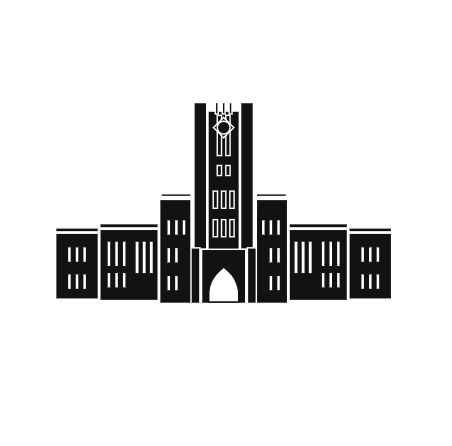

iGEM UTokyo は iGEM に出場する東大チームです。文科一類から理科三類まで全ての科類出身者が在籍します。学部も教養学部、工学部、理学部、医学部、農学部など様々なバックグラウンドを持つ学生 20 名ほどから成り立ちます。iGEM2020 では金賞を目指し活動を行っていて、実験、モデリング、英会話、資金調達（お金が非常にかかるのです！）、プログラミング、ウェブ作成など非常に幅広い活動をします。